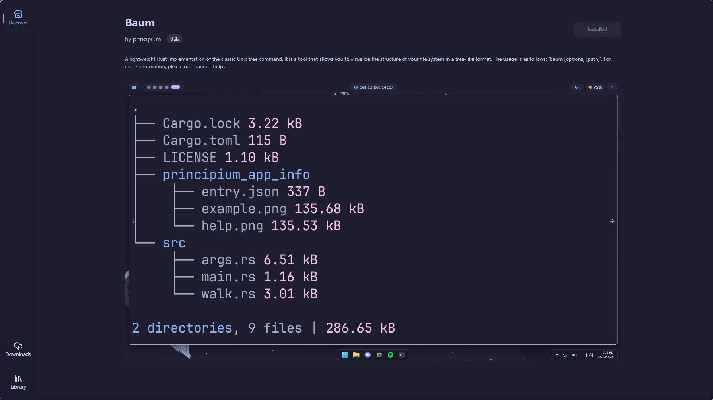
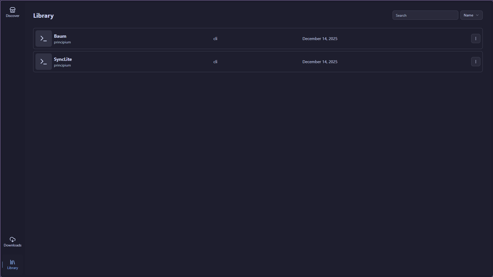

# Principium Store (Desktop App)

**Principium Store** is a lightweight **desktop client** built with **Tauri + React + TypeScript**.

It’s a **desktop app manager** for the Principium ecosystem: it fetches a generated `apps.json` catalog and provides a clean UI (**catppucin** themed) to **discover**, **download/install**, **uninstall**, and **update** Principium apps.

  
  

## How the app catalog works

- The Store fetches an `apps.json` file generated by the [**`principium-app-infos`**](https://github.com/rarescovei5/principium_app_infos) GitHub repo.
- That repo scans the repos on the owner’s GitHub account for folders named **`principium-app-info/`**, reads the metadata inside, and merges everything into a single `apps.json`.

## How including apps in the Store works

To include a repo/app in the Store catalog, we simply need to create a **`principium-app-info/`** folder to the repo with the expected metadata. The `principium-app-infos` aggregator will pick it up and it will appear in the Store after the next catalog update.
